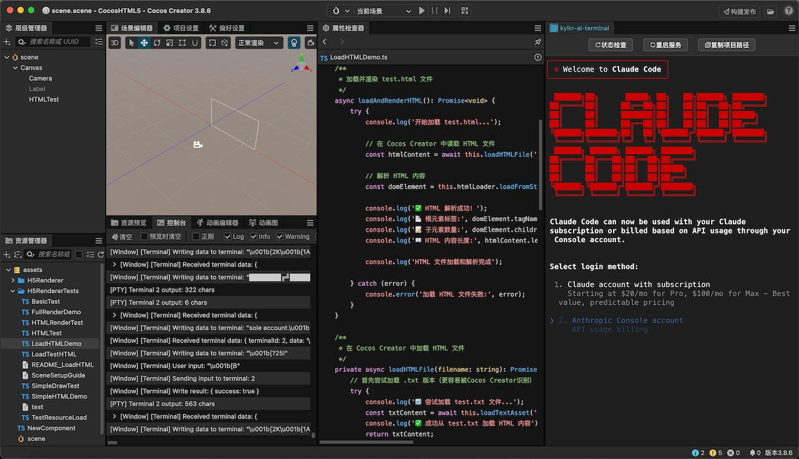

# AI Terminal For Cocos Creator


## 特色

- 提供了在 Cocos Creator 界面中使用命令行的能力
- 支持 Claude Code、Gemini CLI 等基于命令行的 AI 编码智能体
- 支持多标签窗口，方便让智能体和 Shell 同时工作
- 本插件 100% 由 Cursor 生成

## 技术栈

本插件使用最新的 create-cocos-pulgin 进行构建。

地址：https://www.npmjs.com/package/create-cocos-plugin

定位到目标目录，执行下面的命令，根据提示操作即可生成项目模板

```
$ npm create cocos-plugin@latest
```

基于纯 Web 前端技术栈，使得 AI 可以全自动实现想要的功能， 本插件 100% 由 AI 生成，充分证明了全新一代 Cocos 插件开发脚手架的惊人效率。

大家可以尝试自己构建蓝图、Shader Graph、行为树等等重度面板工具了。

## 安装

### 1、下载

下载 Zip 或者 Clone 到本地

### 2、导入

使用插件管理器导入

### 3、安装

1. 确保 NodeJS 版本正确

本插件需要依赖系统的 NodeJS 版本，如果使用了 fnm、nvm 等管理工具，请先使用 `fnm use system` 或者 `nvm use system` 切换到系统的 NodeJS。

2. 执行下面的命令

```bash
npm install
npm run build
```

> 如果苹果 M 芯片提示 x86 不兼容，进入 node-pty 目录，执行 npm rebuild 即可。

3. 再次启动 Cocos Creator，就可以了。
